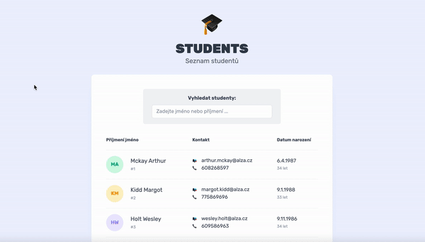

# Angular Students App

A simple web application built with Angular 12. The features of the project:
* Enterprise-Ready architecture
* Modern and responsive UI
* Set up CI/CD

## Live preview

Visit the [https://jaromir-roth.github.io/angular-students-app/](https://jaromir-roth.github.io/angular-students-app/) to see the live preview of the application.

## Development server

Run `ng serve` for a dev server. Navigate to `http://localhost:4200/`. The app will automatically reload if you change any of the source files.

## Build

Run `ng build` to build the project. The build artifacts will be stored in the `dist/` directory.

## Lint

Run `ng lint` to execute linting the code. 

## Running unit tests

Run `ng test` to execute the unit tests via [Karma](https://karma-runner.github.io).

## Further help

To get more help on the Angular CLI use `ng help` or go check out the [Angular CLI Overview and Command Reference](https://angular.io/cli) page.
